# 🏗️ Options-Variants Architecture

## Diagramma Relazioni Database


## Flusso di Creazione Prodotto

```mermaid
flowchart TD
    A[Utente crea Options] --> B{Modalità Creazione}
    
    B -->|Automatica| C[Sistema genera Variants]
    B -->|Manuale| D[Utente crea Variants]
    
    C --> E[Calcola Combinazioni]
    E --> F[Crea Variants + VariantOptions]
    
    D --> G[Utente associa Option Values]
    G --> H[Salva VariantOptions]
    
    F --> I[Salvataggio Database]
    H --> I
    
    I --> J[Export Shopify]
    J --> K[Mappa selectedOptions]
    K --> L[Invio a Shopify API]
```



## Esempio Pratico

### Input Utente
```javascript
// Options definite dall'utente
options: [
  {name: "Color", values: ["Red", "Blue"]},
  {name: "Size", values: ["Small", "Large"]}
]
```

### Generazione Automatica Variants
```javascript
// Sistema genera 4 variants (2×2)
variants: [
  {
    title: "Red - Small",
    price: 10.00,
    option_combination: {"Color": "Red", "Size": "Small"},
    variantOptions: [
      {option_name: "Color", option_value: "Red"},
      {option_name: "Size", option_value: "Small"}
    ]
  },
  {
    title: "Red - Large", 
    price: 12.00,
    option_combination: {"Color": "Red", "Size": "Large"},
    variantOptions: [
      {option_name: "Color", option_value: "Red"},
      {option_name: "Size", option_value: "Large"}
    ]
  },
  // ... altre combinazioni
]
```

### Export Shopify
```json
{
  "product": {
    "title": "T-Shirt",
    "options": [
      {"name": "Color", "values": ["Red", "Blue"]},
      {"name": "Size", "values": ["Small", "Large"]}
    ],
    "variants": [
      {
        "price": "10.00",
        "sku": "TSHIRT-RED-S",
        "selectedOptions": [
          {"name": "Color", "value": "Red"},
          {"name": "Size", "value": "Small"}
        ]
      }
    ]
  }
}
```

## Vantaggi Architettura

1. **Normalizzazione**: Dati non duplicati
2. **Flessibilità**: Supporta N options con M values
3. **Performance**: Query ottimizzate con junction table
4. **Shopify Ready**: selectedOptions standard
5. **Scalabilità**: Gestisce prodotti complessi
6. **Retrocompatibilità**: Non rompe variants esistenti

## API Endpoints Proposti

```javascript
// Generazione automatica variants da options
POST /api/products/:id/generate-variants
{
  "options": [
    {"name": "Color", "values": ["Red", "Blue"]},
    {"name": "Size", "values": ["Small", "Large"]}
  ]
}

// Associazione manuale option values a variant
PUT /api/variants/:id/options
{
  "optionValues": [
    {"option_name": "Color", "option_value": "Red"},
    {"option_name": "Size", "option_value": "Small"}
  ]
}

// Export Shopify con selectedOptions
GET /api/products/:id/shopify-export