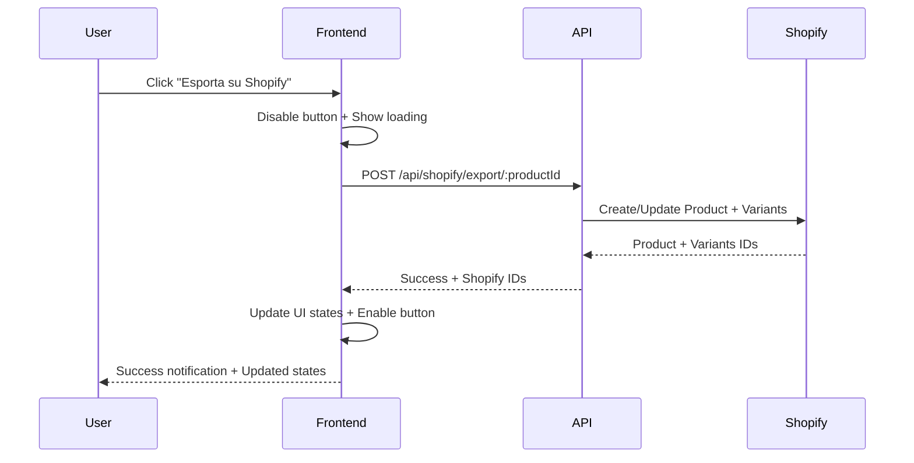
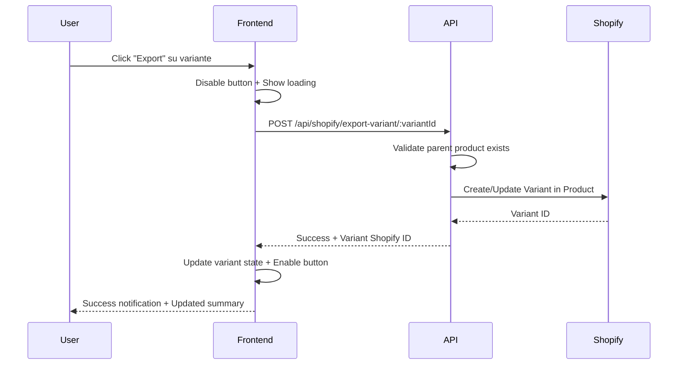

# 🛒 Implementazione Tasti Export Shopify - Product Detail Page

**Data:** 25 Settembre 2025  
**Versione:** 1.0  
**Stato:** ✅ IMPLEMENTATO

---

## 🎯 OBIETTIVO RAGGIUNTO

Implementazione completa di tasti per l'export su Shopify nella pagina di dettaglio del prodotto, con supporto per:
- ✅ Export del prodotto completo con tutte le varianti
- ✅ Export delle singole varianti individualmente
- ✅ Indicatori di stato export in tempo reale
- ✅ Gestione errori e feedback utente
- ✅ Interfaccia utente intuitiva e responsive

---

## 🔧 MODIFICHE IMPLEMENTATE

### **1. Backend API Extensions**

#### **Nuova Route per Export Varianti**
**File:** [`backend/routes/shopify.js`](backend/routes/shopify.js)
```javascript
// POST /api/shopify/export-variant/:variantId
router.post('/export-variant/:variantId', async (req, res, next) => {
    // Implementazione completa per export singole varianti
    // Include validazione, controllo prodotto padre, e gestione errori
});
```

#### **Estensioni ShopifyApiClient**
**File:** [`backend/services/shopifyApi.js`](backend/services/shopifyApi.js)
```javascript
// Nuovi metodi aggiunti:
- createVariantInProduct(productId, variantData)
- updateVariant(variantId, variantData)
- getVariant(variantId)
- deleteVariant(productId, variantId)
```

#### **Estensioni ShopifyMapper**
**File:** [`backend/services/shopifyMapper.js`](backend/services/shopifyMapper.js)
```javascript
// Nuovi metodi aggiunti:
- mapSingleVariantToShopify(variant)
- validateVariantForShopify(variant)
```

### **2. Frontend Implementation**

#### **Interfaccia Utente**
**File:** [`backend/views/pages/product-detail.ejs`](backend/views/pages/product-detail.ejs)

**Sezione Export Prodotto:**
```html
<div class="product-export-actions">
    <div class="export-dashboard">
        <div class="export-summary">
            <div class="summary-item">
                <span class="summary-label">Prodotto:</span>
                <span id="productExportSummary" class="summary-status">⚪ Mai esportato</span>
            </div>
            <div class="summary-item">
                <span class="summary-label">Varianti:</span>
                <span id="variantsExportSummary" class="summary-status">0/0 esportate</span>
            </div>
        </div>
    </div>
    <button id="exportProductBtn" class="btn btn-shopify" onclick="exportProduct()">
        <span class="btn-icon">🛒</span>
        <span class="btn-text">Esporta su Shopify</span>
        <span id="productExportStatus" class="export-status"></span>
    </button>
</div>
```

**Tasti Export Varianti:**
```html
<div class="variant-actions">
    <button class="btn btn-shopify-variant" 
            onclick="exportVariant(${variant.id}, ${index})"
            id="exportVariantBtn-${index}">
        <span class="btn-icon">🛒</span>
        <span class="btn-text">Export</span>
        <span id="variantExportStatus-${index}" class="export-status-sm"></span>
    </button>
</div>
```

#### **Logica JavaScript**
**Funzioni principali implementate:**
- `exportProduct()` - Export prodotto completo
- `exportVariant(variantId, variantIndex)` - Export singola variante
- `updateExportStatus(element, status)` - Aggiornamento indicatori stato
- `updateExportSummary()` - Aggiornamento summary export
- `initializeExportStates()` - Inizializzazione stati al caricamento

#### **Stili CSS**
**File:** [`backend/public/css/components.css`](backend/public/css/components.css)

**Classi principali aggiunte:**
- `.btn-shopify` - Tasto principale export prodotto
- `.btn-shopify-variant` - Tasti export varianti
- `.export-dashboard` - Dashboard riassuntiva
- `.export-status` / `.export-status-sm` - Indicatori stato
- `.status-*` - Classi per colori stati (never, exported, exporting, error, update)

---

## 🎨 DESIGN DELL'INTERFACCIA

### **Indicatori di Stato**
```javascript
const EXPORT_STATUS = {
    NEVER_EXPORTED: { icon: '⚪', text: 'Mai esportato', color: '#6b7280' },
    EXPORTED: { icon: '✅', text: 'Esportato', color: '#10b981' },
    EXPORTING: { icon: '⏳', text: 'Esportando...', color: '#3b82f6' },
    ERROR: { icon: '❌', text: 'Errore export', color: '#ef4444' },
    NEEDS_UPDATE: { icon: '🔄', text: 'Da aggiornare', color: '#f59e0b' }
};
```

### **Colori Shopify Brand**
- **Primario:** `#96bf47` (Verde Shopify)
- **Hover:** `#7da639` (Verde Shopify scuro)
- **Disabilitato:** `#9ca3af` (Grigio)

---

## 🔄 FLUSSI OPERATIVI

### **1. Export Prodotto Completo**


### **2. Export Singola Variante**


---

## 🛡️ GESTIONE ERRORI

### **Validazioni Backend**
- ✅ Controllo esistenza variante
- ✅ Verifica prodotto padre esportato su Shopify
- ✅ Validazione dati variante (prezzo, SKU, etc.)
- ✅ Gestione errori API Shopify
- ✅ Rate limiting e retry logic

### **Feedback Frontend**
- ✅ Notifiche toast per successo/errore
- ✅ Indicatori di loading sui tasti
- ✅ Stati visivi per ogni operazione
- ✅ Messaggi di errore dettagliati
- ✅ Disabilitazione tasti durante operazioni

---

## 📱 RESPONSIVE DESIGN

### **Mobile Optimizations**
```css
@media (max-width: 768px) {
    .product-export-actions {
        flex-direction: column;
        align-items: stretch;
    }
    
    .btn-shopify {
        justify-content: center;
    }
    
    .variant-actions {
        flex-wrap: wrap;
        gap: 0.25rem;
    }
}
```

---

## 🧪 TESTING

### **Test Cases da Verificare**

#### **Export Prodotto Completo**
- [ ] Export nuovo prodotto (mai esportato)
- [ ] Update prodotto esistente (force=true)
- [ ] Gestione errori API Shopify
- [ ] Aggiornamento stati varianti dopo export prodotto

#### **Export Singole Varianti**
- [ ] Export variante con prodotto padre già esportato
- [ ] Tentativo export variante senza prodotto padre
- [ ] Update variante esistente
- [ ] Gestione errori validazione variante

#### **Interfaccia Utente**
- [ ] Indicatori stato corretti al caricamento
- [ ] Aggiornamento real-time durante export
- [ ] Responsive design su mobile
- [ ] Accessibilità tasti e notifiche

#### **Integrazione API**
- [ ] Connessione Shopify configurata
- [ ] Rate limiting gestito correttamente
- [ ] Mapping dati interno ↔ Shopify
- [ ] Persistenza Shopify IDs nel database

---

## 🚀 DEPLOYMENT

### **Checklist Pre-Deploy**
- [x] Backend API implementate e testate
- [x] Frontend UI implementata
- [x] CSS styles aggiunti
- [x] JavaScript functions implementate
- [ ] Configurazione Shopify verificata
- [ ] Test end-to-end completati
- [ ] Documentazione aggiornata

### **Configurazione Richiesta**
```env
# File .env
# IMPORTANTE: NON includere https:// nel SHOPIFY_SHOP_DOMAIN
SHOPIFY_SHOP_DOMAIN=your-shop.myshopify.com
SHOPIFY_ACCESS_TOKEN=your-access-token
SHOPIFY_API_VERSION=2025-01
BASE_URL=http://localhost:3001
```

### **⚠️ Bug Fix Applicati**

#### **1. Errore ENOTFOUND (URL Configuration)**
**Problema risolto:** Errore `ENOTFOUND` causato da doppio `https://` nell'URL Shopify.
- **Causa:** `SHOPIFY_SHOP_DOMAIN=https://shop.myshopify.com` + costruzione automatica URL
- **Soluzione:** Rimosso `https://` dalla configurazione - viene aggiunto automaticamente dal client
- **File modificati:** `backend/.env` e `.env.example`

#### **2. Errore Options-Variants Mapping**
**Problema risolto:** "Product options must have corresponding variants. Please include variant data with your request."
- **Causa:** Varianti senza valori delle opzioni mappati correttamente (option1, option2, option3)
- **Soluzione:** Aggiunto mapping automatico da `selectedOptions` a `option1/2/3` nel ShopifyMapper
- **File modificati:** `backend/services/shopifyMapper.js`
- **Dettagli:** Shopify REST API richiede che ogni variante abbia i valori delle opzioni del prodotto

#### **3. Errore Duplicate Variants**
**Problema risolto:** "The variant 'Default' already exists."
- **Causa:** Tutte le varianti avevano lo stesso valore "Default" per option1, violando l'unicità richiesta da Shopify
- **Soluzione:** Generazione di valori unici per le opzioni quando non disponibili (`Variant 1`, `Variant 2`, etc. o basati su SKU)
- **File modificati:** `backend/services/shopifyMapper.js`
- **Dettagli:** Ogni variante deve avere una combinazione unica di valori delle opzioni

---

## 📋 FUNZIONALITÀ IMPLEMENTATE

### ✅ **Completate**
- Export prodotto completo con tutte le varianti
- Export singole varianti individualmente
- Indicatori stato export real-time
- Dashboard riassuntiva stati export
- Gestione errori completa
- Interfaccia responsive
- Notifiche utente
- Loading states e feedback visivo
- Validazioni backend complete
- Mapping dati Shopify

### 🔄 **Da Testare**
- Integrazione con API Shopify reali
- Performance con molte varianti
- Gestione rate limiting Shopify
- Sincronizzazione bidirezionale

---

## 🎯 RISULTATO FINALE

L'implementazione fornisce una soluzione completa e professionale per l'export di prodotti e varianti su Shopify direttamente dalla pagina di dettaglio del prodotto. L'interfaccia è intuitiva, responsive e fornisce feedback immediato all'utente su tutte le operazioni.

**Caratteristiche principali:**
- 🎨 **UI/UX Professionale** - Design coerente con il brand Shopify
- ⚡ **Performance Ottimizzata** - Operazioni asincrone con feedback real-time
- 🛡️ **Robustezza** - Gestione errori completa e validazioni
- 📱 **Responsive** - Funziona perfettamente su tutti i dispositivi
- 🔧 **Manutenibile** - Codice ben strutturato e documentato
