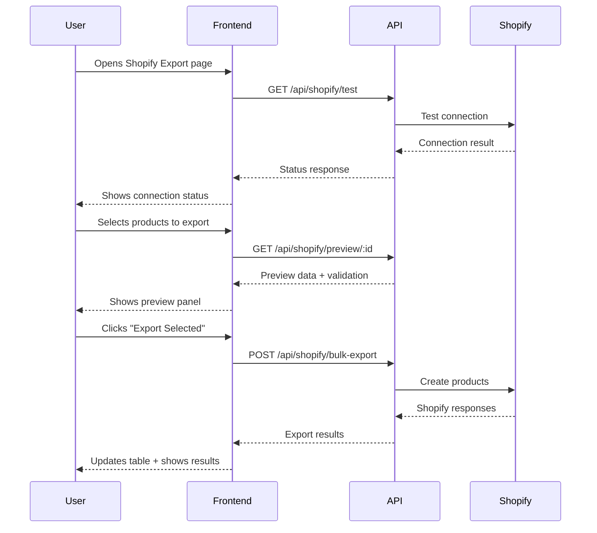
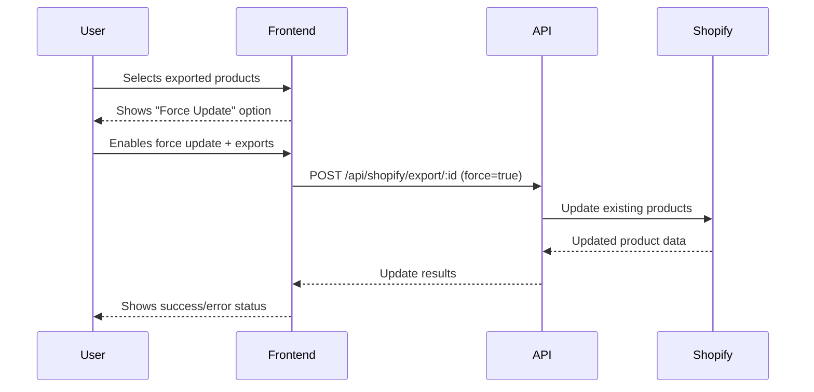
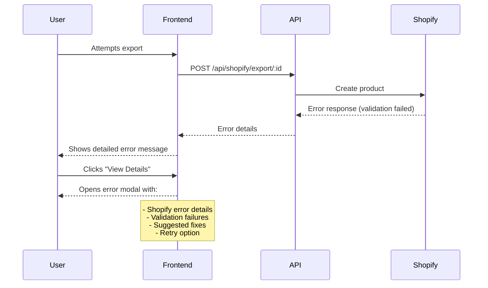

# 🛒 Piano di Implementazione Shopify Export Frontend
## Sistema di Gestione Inventario - Fase Finale

**Data:** 24 Settembre 2025  
**Versione:** 1.0  
**Stato Backend:** ✅ COMPLETO  
**Stato Frontend:** ❌ DA IMPLEMENTARE

---

## 🎯 OBIETTIVO

Implementare un'interfaccia frontend completa per l'export di prodotti verso Shopify, integrando i servizi backend già esistenti e fornendo un'esperienza utente intuitiva e professionale.

---

## 🏗️ ARCHITETTURA BACKEND ESISTENTE

### ✅ **Servizi Implementati**

**1. ShopifyApiClient** ([`backend/services/shopifyApi.js`](backend/services/shopifyApi.js))
- ✅ Autenticazione e configurazione Shopify
- ✅ CRUD operations complete (create, update, get, delete)
- ✅ Gestione inventory e rate limiting
- ✅ Error handling con retry logic
- ✅ Test connessione e monitoring

**2. ShopifyMapper** ([`backend/services/shopifyMapper.js`](backend/services/shopifyMapper.js))
- ✅ Mapping prodotti interni → formato Shopify
- ✅ Conversione variants, images, options, attributes
- ✅ Validazione dati pre-export
- ✅ Mapping response Shopify → formato interno

**3. API Routes** ([`backend/routes/shopify.js`](backend/routes/shopify.js))
- ✅ `GET /api/shopify/test` - Test connessione
- ✅ `GET /api/shopify/rate-limit` - Status rate limit
- ✅ `GET /api/shopify/preview/:productId` - Preview export
- ✅ `POST /api/shopify/export/:productId` - Export singolo
- ✅ `POST /api/shopify/bulk-export` - Export multiplo
- ✅ `PUT /api/shopify/sync/:productId` - Sync da Shopify
- ✅ `DELETE /api/shopify/unlink/:productId` - Unlink prodotto

---

## 🎨 DESIGN DELL'INTERFACCIA

### **Layout Structure**
```
┌─────────────────────────────────────────────────────────────────┐
│ 🛒 Shopify Export                          ← Dashboard          │
├─────────────────────────────────────────────────────────────────┤
│ 📊 Connection Status    │ 📈 Rate Limit    │ ⚙️ Configuration   │
├─────────────────────────────────────────────────────────────────┤
│                                                                 │
│ 📦 Product Selection & Export Controls                         │
│ ┌─────────────────┐ ┌─────────────────┐ ┌─────────────────┐   │
│ │ 🔍 Search       │ │ 📂 Filter       │ │ ✅ Bulk Select  │   │
│ └─────────────────┘ └─────────────────┘ └─────────────────┘   │
│                                                                 │
│ ┌─────────────────────────────────────────────────────────────┐ │
│ │                Product Table                                │ │
│ │ ☑️ │ Product │ Status │ Shopify ID │ Last Export │ Actions │ │
│ └─────────────────────────────────────────────────────────────┘ │
│                                                                 │
├─────────────────────────────────────────────────────────────────┤
│ 🔍 Preview Panel (Collapsible)                                 │
│ ┌─────────────────────────────────────────────────────────────┐ │
│ │ Shopify Data Preview + Validation Results                  │ │
│ └─────────────────────────────────────────────────────────────┘ │
├─────────────────────────────────────────────────────────────────┤
│ 📊 Progress & Operations                                        │
│ ┌─────────────────────────────────────────────────────────────┐ │
│ │ Progress Bar │ Status Messages │ Cancel Button              │ │
│ └─────────────────────────────────────────────────────────────┘ │
├─────────────────────────────────────────────────────────────────┤
│ 📋 Export History & Logs                                       │
│ ┌─────────────────────────────────────────────────────────────┐ │
│ │ Recent Exports │ Error Logs │ Statistics                   │ │
│ └─────────────────────────────────────────────────────────────┘ │
└─────────────────────────────────────────────────────────────────┘
```

### **Color Coding System**
- 🟢 **Verde** - Prodotti già esportati con successo
- 🟡 **Giallo** - Prodotti pronti per export (validazione OK)
- 🔴 **Rosso** - Prodotti con errori di validazione
- 🔵 **Blu** - Operazioni in corso
- ⚪ **Grigio** - Prodotti mai esportati

---

## 📋 FUNZIONALITÀ DETTAGLIATE

### **1. Connection Management**
```javascript
// Status indicators
- 🟢 Connected to Shopify
- 🔴 Connection Failed
- 🟡 Rate Limit Warning (>80%)
- ⚪ Not Configured

// Actions
- Test Connection Button
- Rate Limit Refresh
- Configuration Link
```

### **2. Product Selection Interface**
```javascript
// Filters
- Status: [All, Never Exported, Exported, Errors, Updated]
- Category: [Dropdown with categories]
- Date Range: [Last Export Date]
- Search: [Title, SKU, Handle]

// Bulk Actions
- Select All / None
- Export Selected (Bulk)
- Preview Selected
- Validate Selected
```

### **3. Product Table Columns**
```javascript
[
  { field: 'checkbox', width: '40px' },
  { field: 'title', label: 'Product', sortable: true },
  { field: 'status', label: 'Export Status', width: '120px' },
  { field: 'shopify_id', label: 'Shopify ID', width: '100px' },
  { field: 'last_export', label: 'Last Export', width: '120px' },
  { field: 'actions', label: 'Actions', width: '150px' }
]
```

### **4. Export Actions per Product**
```javascript
// Single Product Actions
- 👁️ Preview - Show Shopify data preview
- 🚀 Export - Export to Shopify
- 🔄 Update - Force update existing
- 🔗 Sync - Sync from Shopify
- ❌ Unlink - Remove Shopify connection
```

### **5. Preview Panel**
```javascript
// Preview Content
- Shopify Product Data (JSON formatted)
- Validation Results (Errors/Warnings)
- Mapping Summary (Variants, Images, Attributes)
- Export Options (Force Update, etc.)
```

### **6. Progress Tracking**
```javascript
// Progress States
- Idle: "Ready to export"
- Running: "Exporting 3 of 10 products..."
- Success: "Export completed successfully"
- Error: "Export failed - see logs"
- Cancelled: "Export cancelled by user"

// Progress Bar
- Real-time percentage
- Current operation description
- Estimated time remaining
- Cancel button (when running)
```

### **7. History & Logging**
```javascript
// Export History Table
[
  { field: 'timestamp', label: 'Date/Time' },
  { field: 'operation', label: 'Operation' },
  { field: 'products_count', label: 'Products' },
  { field: 'success_count', label: 'Success' },
  { field: 'error_count', label: 'Errors' },
  { field: 'duration', label: 'Duration' }
]

// Error Logs
- Detailed error messages
- Product-specific failures
- Shopify API errors
- Validation failures
```

---

## 🔧 IMPLEMENTAZIONE TECNICA

### **File Structure**
```
backend/views/pages/
├── shopify-export.ejs          # Main export page
└── shopify-config.ejs          # Configuration page (optional)

backend/routes/
└── views.js                    # Add shopify export route

backend/public/js/pages/
└── shopify-export.js           # Frontend JavaScript
```

### **JavaScript Modules**
```javascript
// Core Classes
class ShopifyExportManager {
  constructor() {
    this.products = [];
    this.selectedProducts = new Set();
    this.isExporting = false;
    this.connectionStatus = null;
  }
  
  async loadProducts() { /* Load products with export status */ }
  async testConnection() { /* Test Shopify connection */ }
  async exportProduct(productId, options) { /* Single export */ }
  async bulkExport(productIds, options) { /* Bulk export */ }
  async previewProduct(productId) { /* Preview export data */ }
  async syncProduct(productId) { /* Sync from Shopify */ }
  async unlinkProduct(productId) { /* Unlink from Shopify */ }
}

class ConnectionMonitor {
  constructor(manager) {
    this.manager = manager;
    this.status = 'unknown';
    this.rateLimit = null;
  }
  
  async checkConnection() { /* Test connection */ }
  async getRateLimit() { /* Get rate limit status */ }
  startMonitoring() { /* Periodic status checks */ }
}

class ProgressTracker {
  constructor() {
    this.isRunning = false;
    this.current = 0;
    this.total = 0;
    this.errors = [];
    this.startTime = null;
  }
  
  start(total) { /* Start progress tracking */ }
  update(current, message) { /* Update progress */ }
  addError(error) { /* Add error to log */ }
  complete() { /* Complete operation */ }
  cancel() { /* Cancel operation */ }
}

class ValidationHandler {
  static validateProduct(product) {
    /* Validate product for Shopify export */
    return {
      isValid: boolean,
      errors: string[],
      warnings: string[]
    };
  }
  
  static formatValidationResults(validation) {
    /* Format validation for display */
  }
}

class HistoryManager {
  constructor() {
    this.history = [];
    this.maxEntries = 100;
  }
  
  addEntry(operation) { /* Add history entry */ }
  getHistory() { /* Get export history */ }
  clearHistory() { /* Clear history */ }
  exportHistory() { /* Export history to CSV */ }
}
```

### **API Integration Pattern**
```javascript
// Standard API call pattern
async function callShopifyAPI(endpoint, options = {}) {
  try {
    showLoading();
    const response = await fetch(endpoint, {
      method: options.method || 'GET',
      headers: {
        'Content-Type': 'application/json',
        ...options.headers
      },
      body: options.body ? JSON.stringify(options.body) : undefined
    });
    
    const data = await response.json();
    
    if (!response.ok) {
      throw new Error(data.error || 'API call failed');
    }
    
    return data;
  } catch (error) {
    showError(error.message);
    throw error;
  } finally {
    hideLoading();
  }
}
```

---

## 🎯 USER EXPERIENCE FLOW

### **Scenario 1: First Time Export**


### **Scenario 2: Update Existing Products**


### **Scenario 3: Error Handling**


---

## 📊 STATI E INDICATORI

### **Product Export Status**
```javascript
const EXPORT_STATUS = {
  NEVER_EXPORTED: {
    color: '#6b7280',
    icon: '⚪',
    label: 'Never Exported',
    description: 'Product has never been exported to Shopify'
  },
  EXPORTED: {
    color: '#10b981',
    icon: '✅',
    label: 'Exported',
    description: 'Product successfully exported to Shopify'
  },
  UPDATED: {
    color: '#3b82f6',
    icon: '🔄',
    label: 'Updated',
    description: 'Product updated in Shopify'
  },
  ERROR: {
    color: '#ef4444',
    icon: '❌',
    label: 'Export Error',
    description: 'Export failed - click for details'
  },
  VALIDATION_ERROR: {
    color: '#f59e0b',
    icon: '⚠️',
    label: 'Validation Error',
    description: 'Product has validation errors'
  },
  EXPORTING: {
    color: '#8b5cf6',
    icon: '⏳',
    label: 'Exporting...',
    description: 'Export in progress'
  }
};
```

### **Connection Status**
```javascript
const CONNECTION_STATUS = {
  CONNECTED: {
    color: '#10b981',
    icon: '🟢',
    label: 'Connected',
    description: 'Successfully connected to Shopify'
  },
  DISCONNECTED: {
    color: '#ef4444',
    icon: '🔴',
    label: 'Disconnected',
    description: 'Cannot connect to Shopify'
  },
  RATE_LIMITED: {
    color: '#f59e0b',
    icon: '🟡',
    label: 'Rate Limited',
    description: 'Shopify API rate limit exceeded'
  },
  NOT_CONFIGURED: {
    color: '#6b7280',
    icon: '⚪',
    label: 'Not Configured',
    description: 'Shopify credentials not configured'
  }
};
```

---

## 🚀 PIANO DI IMPLEMENTAZIONE

### **Fase 1: Struttura Base** (Priorità Alta)
- [ ] Creare pagina `shopify-export.ejs` con layout base
- [ ] Implementare connection status e test
- [ ] Aggiungere route `/shopify-export` in views.js
- [ ] Creare JavaScript base con ShopifyExportManager

### **Fase 2: Product Selection** (Priorità Alta)
- [ ] Implementare tabella prodotti con filtri
- [ ] Aggiungere selezione multipla e bulk actions
- [ ] Implementare indicatori stato export
- [ ] Aggiungere ricerca e ordinamento

### **Fase 3: Export Operations** (Priorità Alta)
- [ ] Implementare export singolo con preview
- [ ] Aggiungere bulk export con progress tracking
- [ ] Implementare gestione errori e retry
- [ ] Aggiungere validazione pre-export

### **Fase 4: Advanced Features** (Priorità Media)
- [ ] Implementare preview panel dettagliato
- [ ] Aggiungere sync da Shopify
- [ ] Implementare unlink prodotti
- [ ] Aggiungere export history e logs

### **Fase 5: Polish & Testing** (Priorità Media)
- [ ] Ottimizzare UX e responsive design
- [ ] Aggiungere animazioni e feedback
- [ ] Testing completo di tutti i flussi
- [ ] Documentazione utente

---

## 🎨 MOCKUP INTERFACCIA

### **Header Section**
```
🛒 Shopify Export                                    ← Dashboard
━━━━━━━━━━━━━━━━━━━━━━━━━━━━━━━━━━━━━━━━━━━━━━━━━━━━━━━━━━━━━━━━━━━━━━━━━━━━━━━━━━━━━━━━━━━━━━━━━━━━━━━━━━━━━━━━━━━━━━━━━━━━━━━━━━━━━━━━━━━━━━━━━━━━━━━━━━━━━━━━━━━━━━━━━━━━━━━━━━━━━━━━━━━━━━━━━━━━━━━━━━━━━━━━━━━━━━━━━━━━━━━━━━━━━━━━━━━━━━━━━━━━━━━━━━━━━━━━━━━━━━━━━━━━━━━━━━━━━━━━━━━━━━━━━━━━━━━━━━━━━━━━━━━━━━━━━━━━━━━━━━━━━━━━━━━━━━━━━━━━━━━━━━━━━━━━━━━━━━━━━━━━━━━━━━━━━━━━━━━━━━━━━━━━━━━━━━━━━━━━━━━━━━━━━━━━━━━━━━━━━━━━━━━━━━━━━━━━━━━━━━━━━━━━━━━━━━━━━━━━━━━━━━━━━━━━━━━━━━━━━━━━━━━━━━━━━━━━━━━━━━━━━━━━━━━━━━━━━━━━━━━━━━━━━━━━━━━━━━━━━━━━━━━━━━━━━━━━━━━━━━━━━━━━━━━━━━━━━━━━━━━━━━━━━━━━━━━━━━━━━━━━━━━━━━━━━━━━━━━━━━━━━━━━━━━━━━━━━━━━━━━━━━━━━━━━━━━━━━━━━━━━━━━━━━━━━━━━━━━━━━━━━━━━━━━━━━━━━━━━━━━━━━━━━━━━━━━━━━━━━━━━━━━━━━━━━━━━━━━━━━━━━━━━━━━━━━━━━━━━━━━━━━━━━━━━━━━━━━━━━━━━━━━━━━━━━━━━━━━━━━━━━━━━━━━━━━━━━━━━━━━━━━━━━━━━━━━━━━━━━━━━━━━━━━━━━━━━━━━━━━━━━━━━━━━━━━━━━━━━━━━━━━━━━━━━━━━━━━━━━━━━━━━━━━━━━━━━━━━━━━━━━━━━━━━━━━━━━━━━━━━━━━━━━━━━━━━━━━━━━━━━━━━━━━━━━━━━━━━━━━━━━━━━━━━━━━━━━━━━━━━━━━━━━━━━━━━━━━━━━━━━━━━━━━━━━━━━━━━━━━━━━━━━━━━━━━━━━━━━━━━━━━━━━━━━━━━━━━━━━━━━━━━━━━━━━━━━━━━━━━━━━━━━━━━━━━━━━━━━━━━━━━━━━━━━━━━━━━━━━━━━━━━━━━━━━━━━━━━━━━━━━━━━━━━━━━━━━━━━━━━━━━━━━━━━━━━━━━━━━━━━━━━━━━━━━━━━━━━━━━━━━━━━━━━━━━━━━━━━━━━━━━━━━━━━━━━━━━━━━━━━━━━━━━━━━━━━━━━━━━━━━━━━━━━━━━━━━━━━━━━━━━━━━━━━━━━━━━━━━━━━━━━━━━━━━━━━━━━━━━━━━━━━━━━━━━━━━━━━━━━━━━━━━━━━━━━━━━━━━━━━━━━━━━━━━━━━━━━━━━━━━━━━━━━━━━━━━━━━━━━━━━━━━━━━━━━━━━━━━━━━━━━━━━━━━━━━━━━━━━━━━━━━━━━━━━━━━━━━━━━━━━━━━━━━━━━━━━━━━━━━━━━━━━━━━━━━━━━━━━━━━━━━━━━━━━━━━━━━━━━━━━━━━━━━━━━━━━━━━━━━━━━━━━━━━━━━━━━━━━━━━━━━━━━━━━━━━━━━━━━━━━━━━━━━━━━━━━━━━━━━━━━━━━━━━━━━━━━━━━━━━━━━━━━━━━━━━━━━━━━━━━━━━━━━━━━━━━━━━━━━━━━━━━━━━━━━━━━━━━━━━━━━━━━━━━━━━━━━━━━━━━━━━━━━━━━━━━━━━━━━━━━━━━━━━━━━━━━━━━━━━━━━━━━━━━━━━━━━━━━━━━━━━━━━━━━━━━━━━━━━━━━━━━━━━━━━━━━━━━━━━━━━━━━━━━━━━━━━━━━━━━━━━━━━━━━━━━━━━━━━━━━━━━━━━━━━━━━━━━━━━━━━━━━━━━━━━━━━━━━━━━━━━━━━━━━━━━━━━━━━━━━━━━━━━━━━━━━━━━━━━━━━━━━━━━━━━━━━━━━━━━━━━━━━━━━━━━━━━━━━━━━━━━━━━━━━━━━━━━━━━━━━━━━━━━━━━━━━━━━━━━━━━━━━━━━━━━━━━━━━━━━━━━━━━━━━━━━━━━━━━━━━━━━━━━━━━━━━━━━━━━━━━━━━━━━━━━━━━━━━━━━━━━━━━━━━━━━━━━━━━━━━━━━━━━━━━━━━━━━━━━━━━━━━━━━━━━━━━━━━━━━━━━━━━━━━━━━━━━━━━━━━━━━━━━━━━━━━━━━━━━━━━━━━━━━━━━━━━━━━━━━━━━━━━━━━━━━━━━━━━━━━━━━━━━━━━━━━━━━━━━━━━━━━━━━━━━━━━━━━━━━━━━━━━━━━━━━━━━━━━━━━━━━━━━━━━━━━━━━━━━━━━━━━━━━━━━━━━━━━━━━━━━━━━━━━━━━━━━━━━━━━━━━━━━━━━━━━━━━━━━━━━━━━━━━━━━━━━━━━━━━━━━━━━━━━━━━━━━━━━━━━━━━━━━━━━━━━━━━━━━━━━━━━━━━━━━━━━━━━━━━━━━━━━━━━━━━━━━━━━━━━━━━━━━━━━━━━━━━━━━━━━━━━━━━━━━━━━━━━━━━━━━━━━━━━━━━━━━━━━━━━━━━━━━━━━━━━━━━━━━━━━━━━━━━━━━━━━━━━━━━━━━━━━━━━━━━━━━━━━━━━━━━━━━━━━━━━━━━━━━━━━━━━━━━━━━━━━━━━━━━━━━━━━━━━━━━━━━━━━━━━━━━━━━━━━━━━━━━━━━━━━━━━━━━━━━━━━━━━━━━━━━━━━━━━━━━━━━━━━━━━━━━━━━━━━━━━━━━━━━━━━━━━━━━━━━━━━━━━━━━━━━━━━━━━━━━━━━━━━━━━━━━━━━━━━━━━━━━━━━━━━━━━━━━━━━━━━━━━━━━━━━━━━━━━━━━━━━━━━━━━━━━━━━━━━━━━━━━━━━━━━━━━━━━━━━━━━━━━━━━━━━━━━━━━━━━━━━━━━━━━━━━━━━━━━━━━━━━━━━━━━━━━━━━━━━━━━━━━━━━━━━━━━━━━━━━━━━━━━━━━━━━━━━━━━━━━━━━━━━━━━━━━━━━━━━━━━━━━━━━━━━━━━━━━━━━━━━━━━━━━━━━━━━━━━━━━━━━━━━━━━━━━━━━━━━━━━━━━━━━━━━━━━━━━━━━━━━━━━━━━━━━━━━━━━━━━━━━━━━━━━━━━━━━━━━━━━━━━━━━━━━━━━━━━━━━━━━━━━━━━━━━━━━━━━━━━━━━━━━━━━━━━━━━━━━━━━━━━━━━━━━━━━━━━━━━━━━━━━━━━━━━━━━━━━━━━━━━━━━━━━━━━━━━━━━━━━━━━━━━━━━━━━━━━━━━━━━━━━━━━━━━━━━━━━━━━━━━━━━━━━━━━━━━━━━━━━━━━━━━━━━━━━━━━━━━━━━━━━━━━━━━━━━━━━━━━━━━━━━━━━━━━━━━━━━━━━━━━━━━━━━━━━━━━━━━━━━━━━━━━━━━━━━━━━━━━━━━━━━━━━━━━━━━━━━━━━━━━━━━━━━━━━━━━━━━━━━━━━━━━━━━━━━━━━━━━━━━━━━━━━━━━━━━━━━━━━━━━